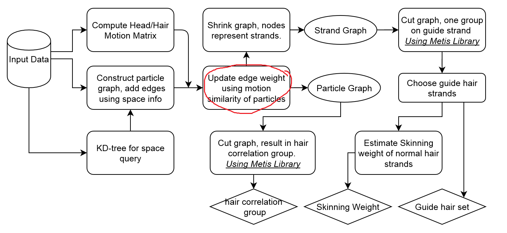

# Report 160310
## Summary
In the early of this week, I generated the high-quality hair simulation result using maya nHair.
The rendering result is as following (5k strands, 100k particles):

Later I start to process these data. Now I am implementing Section 5.2, whose input is the data set and output a graph with movement similarity between strands.

As I implementing it using python, I benefit much from various library online. However, the drawback is the performance of python, especially the operation on graphs. Even we only have 5k strands now, It takes minutes to process single frame.

## Implementation Plan

Zhou's algorithm consists of two parts---training and simulation. Since performance is not important for training, I choose to use python for flexibility and abundant libraries. For simulation, I can build upon my previous code of hair simulation.

### Training Part

**Input**  
* Head motion
* hair strand motion data

**Output**  
* A set of guide hair strands
* skinning weights for normal hair strands
* hair correlation group

### Simulation Part

*This part has not been carefully researched so I only give an overview.*

**Hair/Hair Interaction**  
This part is a common step for hair simulation. But Zhou found that it is a bottleneck of real-time simulation. He gave a strategy to more efficiently update the links between hair edges by using kNN search.

**Skinning Normal Strands**  
It is easy, using the output of training stage, with a linear interpretation algorithm.

**Hair Correlation**  
A optimal method to make normal strands behave as they have volumes. The equation 10 in the paper is easy to evaluate, but minimize the equation in real-time is more complex.
