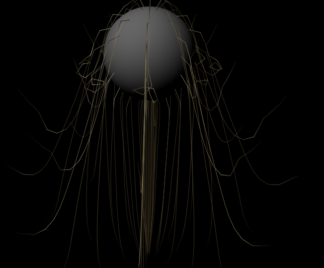
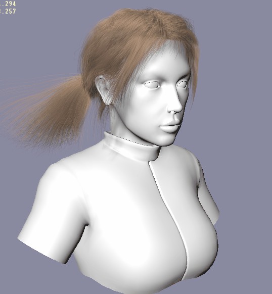

# Report 160303
## Summary

In the last week, I've finished exploring the method of obtaining high-quality training data of hair simulation.

In the beginning, I searched the Github for available code. I run several programs claimed to perform hair simulation result, but none of [them](https://github.com/stars) gave a satisfied result.

So I turned to the industry to seek solution. This way proved to be more reliable. Now I decided to use the nCloth module of Autodesk Maya to get the data. In addition, other industry resources might be helpful.

### nCloth

nCloth is part of maya since version 2013. It contains the whole pipeline from generating hair to hair simulation and rendering. The simulation data can be cached with nCache into an open format. One minor problem is that I do not know how to import the vertex position to generate hair in nCloth. So I may need to create the hair strand by nCloth tools, which may not be so pretty.

### TressFX

It is released by AMD since several years ago. Recently, AMD release tressfx v3.0 on Github, makeing it an open source library for hair simulation and rendering. Its performance is good on both most of the discrete GPUs. However, it is designed for the game dev. I read its API and it does not offer so many custom options like nCloth. And the vertex exportation is not supported, though can be written by myself. Except that, It could be a good tutorial of how to create a real-time application for hair simulation and rendering.

### Hairworks

Hairworks is released by Nvidia, possibly aiming at competing with TressFx. It is also designed for realtime application. Its demo seems indicating better quality than TressFX. In fact, it is the first product I tried. However, I couldn't access its source and the simulation and rendering pipeline is fully encapsulated so the vertex buffer is invisible. So I cannot export data with it.

### Blender

Open source 3D CAD tools like Maya. [It was said](http://code.blender.org/2014/09/hair-system-roadmap/)  it recently upgraded its particle solver. But I never used this software. So I did not pay much attention on it.

## Next Step

To make a good implementation, both high-quality data and training codes are necessary. Since I can now get a feasible training data, I prefer start from the latter.
