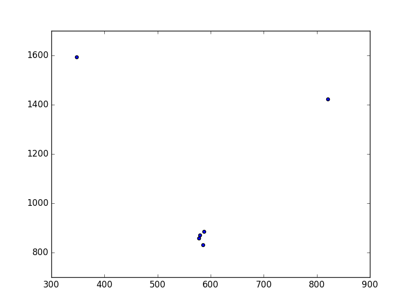

# Report 160331

## Summary
This week I made a more dense hair model with 15k strands and run the first half of the pipeline. The rest of the pipeline is still running and the reports maybe available in the late of 1st April.


### Reconstruction Error
I also corrected some mistakes, **one of which is caused by misunderstanding of the paper equation 8**. This mistakes causes in general less guide hairs for each normal hair, and dramatically increased the reconstruction error. A few incomplete test (e.g. sample only 10 frames) indicates that after solving the mistake, the reconstruction error appear to be not related to the guide hair selection:
```
Guide selection: worst  
Guide edge sum 27364830.000000, energy from 21834.488544 t0 13941.325242

Guide selection: rand  
Guide edge sum 37748784.000000, energy from 21851.236549 t0 13316.771796

Guide selection: opt  
Guide edge sum 59445040.000000, energy from 27739.400598 t0 15460.579816
```
Even so, it is better than the previous result (below, with x-axis the guide edge sum and y-axis the error), which indicates the optimized guide hair selection had the worst error. Hope that the full training gives a good result.



However, it is also possible that there is no better choice of guide hairs, so the error appears to be irrelevant of guide hair selection.

### Pipeline change
Another change I made is to support very large data training. Previous all the data is stored in the memory. I found it is not feasible when there are more than 10k strands. So I rearrange the pipeline to make it suitable for large data training.

### Performance
The following data is from the 15k strands, 400k particles model.
```
Similarity Graph building: about 20h
Weight Estimation: about 5h  
Other stages are very fast that less than 1 minutes
```
