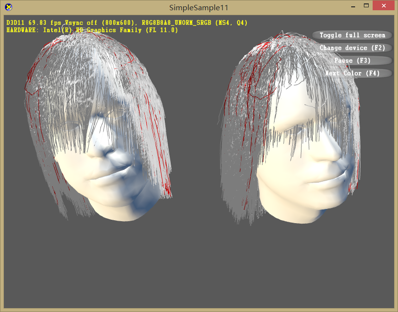
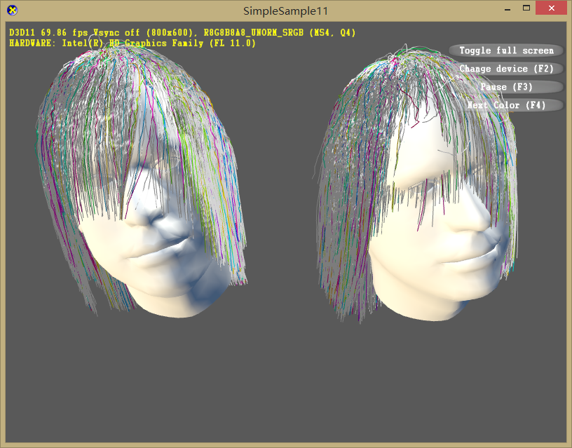
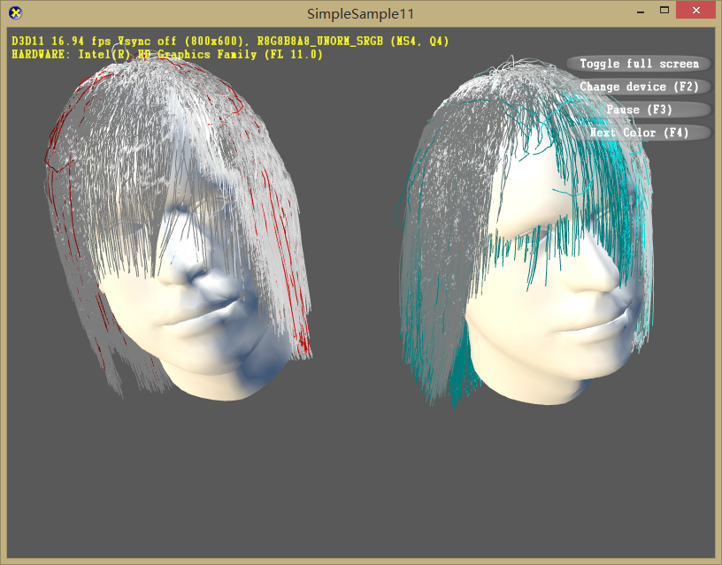
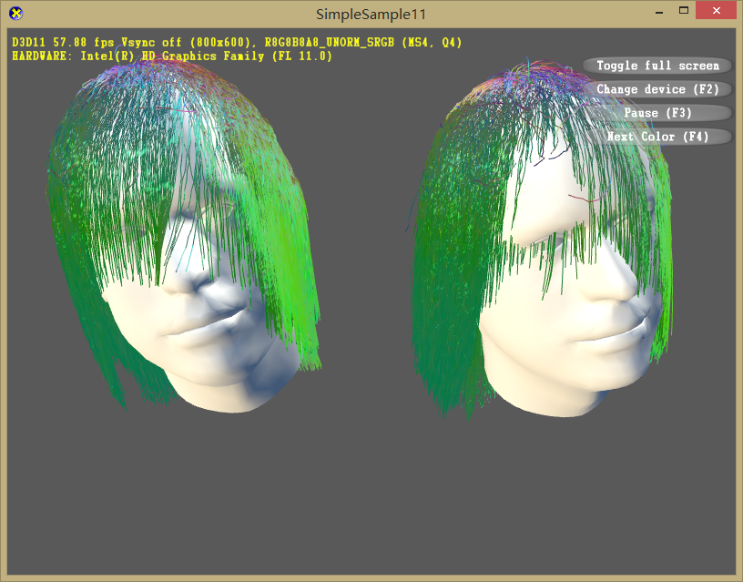

# Report 160420

## Summary

I tried to use Nvidia's Hairwork to render my hair strands. However, the rendering code is related closely to the simulation code, and it is too complicated so I gave up after the first try.

Then I added simplified Deep Shadow Map on my hair renderer. Added the head motion. Several color mapping is available now.

I Also re-run my code with a more sophisticated hair model.

## Color mapping

### ***The left is ground truth, the right is interpolation result!!! ***

#### random color

#### guide hair is red

#### selected group of hair is colored (the same color means the same group)

#### Left: guide hair is red
#### Right: blue hair has large error

#### color map using direction hair

