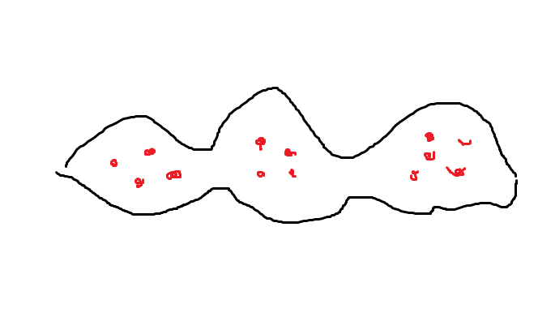
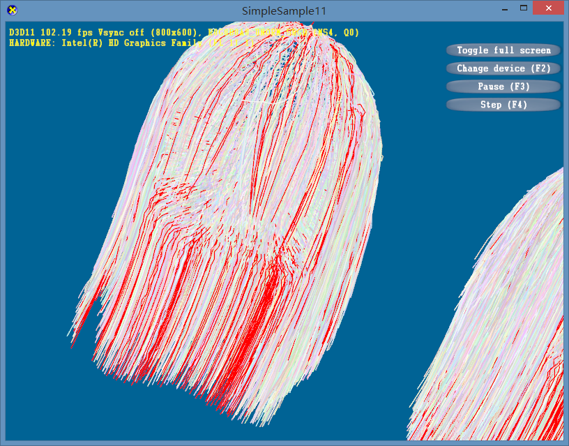
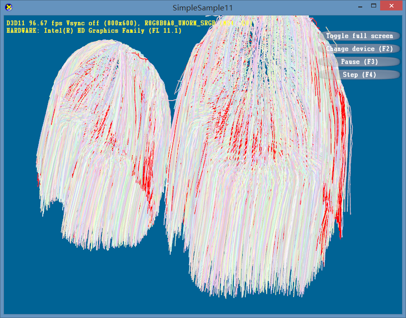
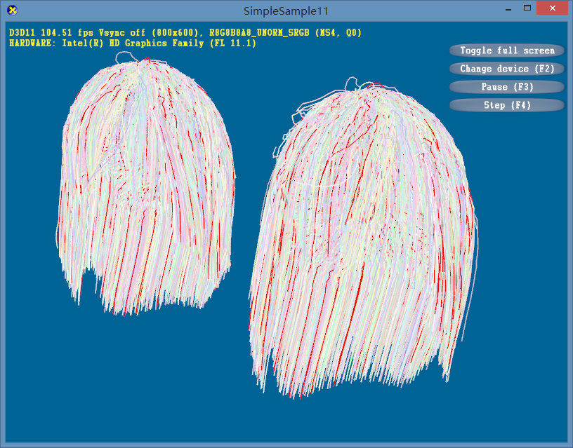
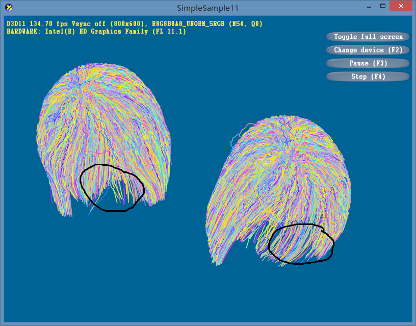
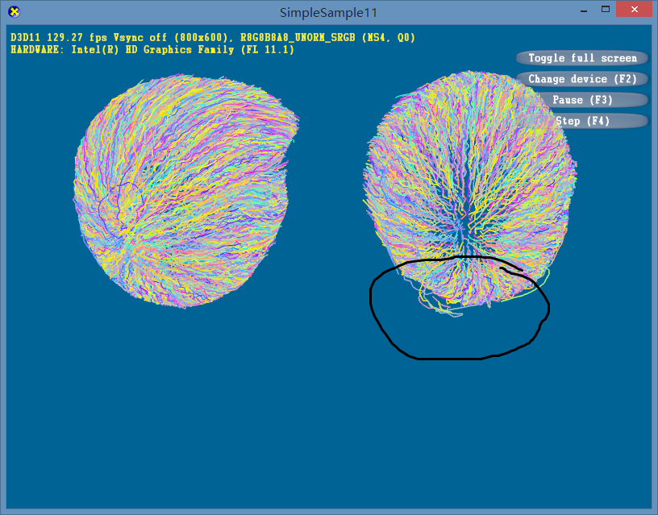
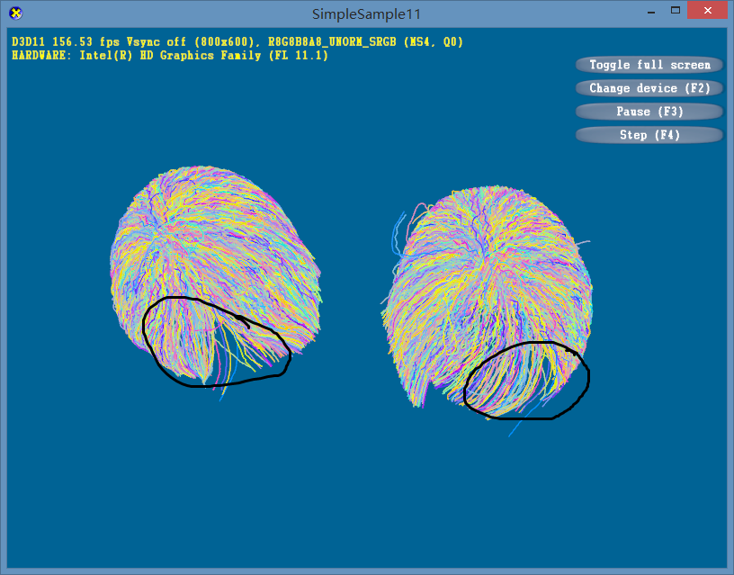
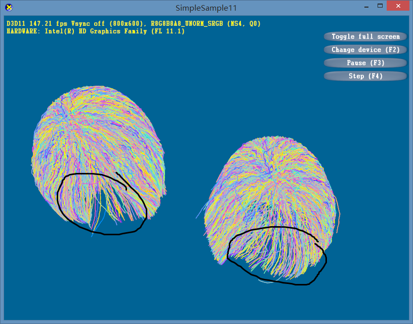

# Report 160407

## Summary

I visualized the interpolation outcome and analysis the confused phenomenon. For why the guide selection scheme does not worked, I have 80% of confidence that the problem lies on Zhou's method. Here is the details.

## Video

All the videos are available here, **the left is ground truth and right is the interpolation result**. there are three videos:
* random guide strand selection [[video]](rand.gif):  
Energy 51,040,332, error 420,368

* optimized guide strand selection, where I maximize the Equation 7 [[video]](opt.gif):  
Energy 62,641,917, error 519,369

* worst guide strand selection, where I minimize the Equation 7 [[video]](worst.gif):   
Energy 35,488,631, error 491,521

## Analysis

### Assumption of Zhou's guide hair selection

1. The hair can be grouped, and groups have similar sizes.  
This is because by Metis Library, the graph is partitioned into parts of the same size.

2. The strands of the same group is more likely to have similar movement, and vice versa.

3. The guide hair often lies in the center of thick hair area.  
This assumption is quite implicit. According to Zhou's method, the strand which has the most strong connection is more likely to be the guide hair. The ranking algorithm tends to give strand with many other strands surrounded the best score. Therefore, strand in the thin hair area, e.g., the hair bangs, is not likely to be selected.

The picture above is conclusion of these assumptions. The black line is the profile of the cross section of hair strands. And the red points are where the guide hair lie according to Zhou's methods.

### Experiments

I visualize the guide hair selection of different schemes:

The above is by worst guide hair selection. We notice these guide hairs often lie on the boundary of hair profile, or in the thin area like the hair bangs.

The above is by optimized guide hair selection. As expected, this condition is the complementary set of the worst condition. Nearly no hair strand of the hair bangs is selected.

Random cases. We see it is quite uniformly distributed through the hair. And the reconstruction errors are quite stable among different random selection cases.

### Where is the error?

***Again, left is Ground Truth, and right is Interpolation Result.***

Random cases. The hair bangs has big movement and sparser guide hair distribution. So cannot fit well.

Random cases. Some individual hair strands, if not selected as the guide hairs, will have quite strange behaviors.

Worst cases. As there are many guide hair strands in the hair bangs area, the hair bangs have much better fitting than any other cases.

Optimized cases. The fitting at hair bangs is quite imprecise, as there is no guide hairs there.

### Conclusion

Zhou's method has its assumptions, which may only suitable for a certain type of hair styles.

1. It tends to have more density of guide hairs at thick areas. But the problem is the movement tends to vary slowly at thick areas (because all strands move together), so less density of guide hairs is needed. This pretty much like the mesh modeling, where abrupt varying area (corners, edges, etc.) needs more control points.

2. Every hair group should not be the same size. Arbitrarily apply the same size may result in worse guide hair selection schemes.

Also, reconstruction error evaluation is not directly linked to the visual quality, since people are more likely to notice the strange areas, featured hairs, rather than the sum of reconstruction errors.
