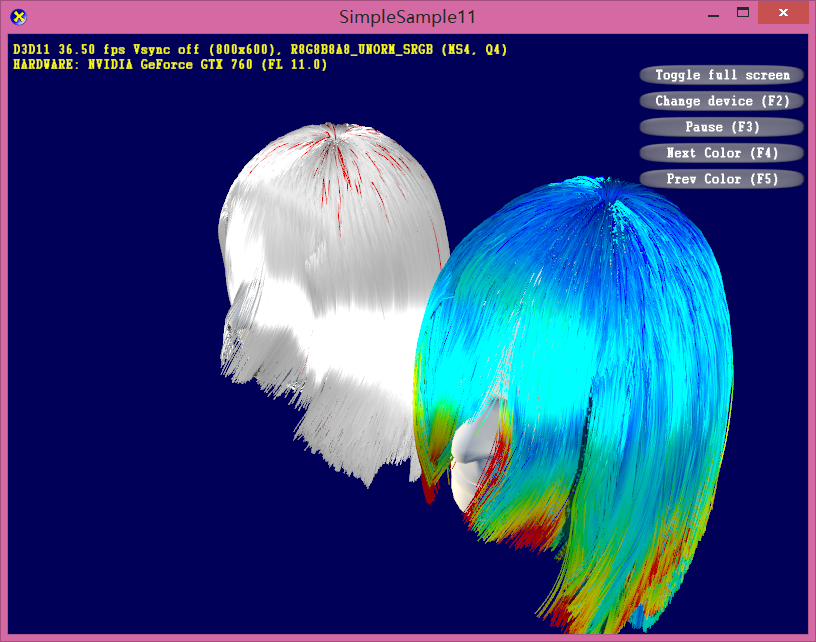
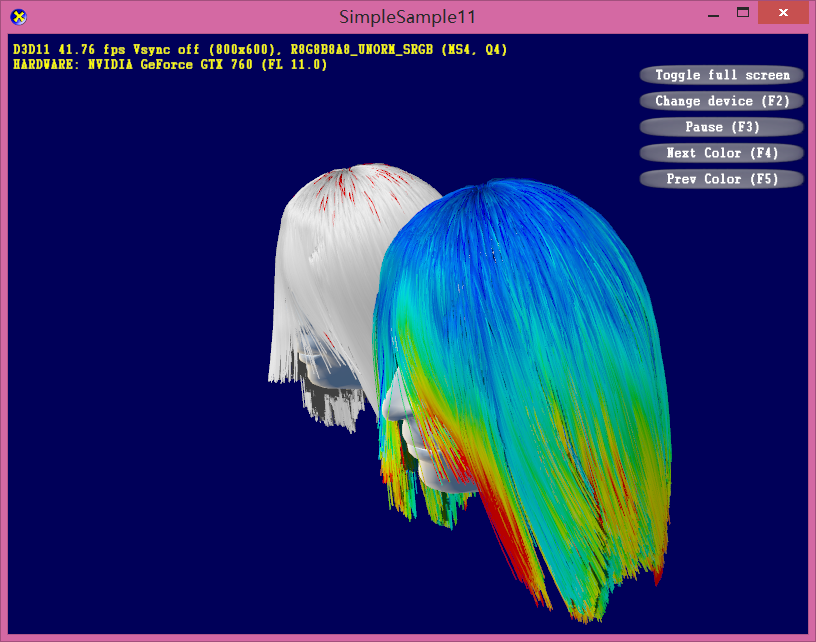
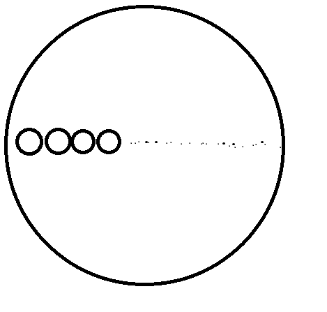
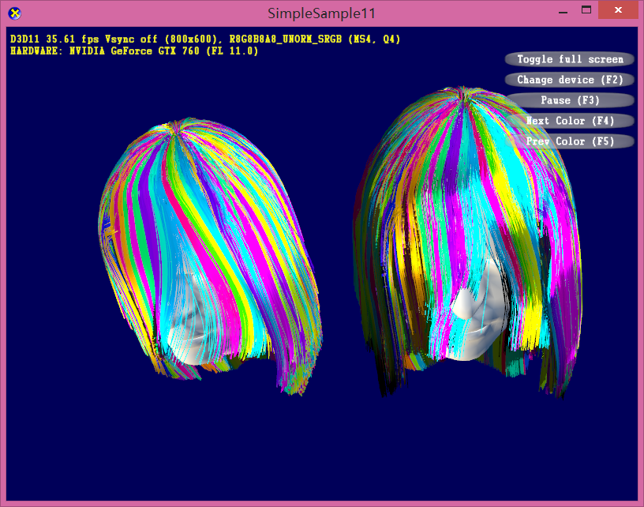

# Report 160530

## Rendering Implementation
I have Implement the R and TT component calculation of hair rendering in "Light Scattering from Human Hair Fibers". The rendering result looks better as the highlight added. More parameter needs to be tuned for better looking.

After implementation

Before implementation

## Experiment Result

`Condition`  
* 22k strands  
* 25 particles per strand  
* 200 frames  
* neighbor: r = 3~4 collision radius of particles

`Result`  
* Particle graph: 5M edges, 10 edges per particle on average
* Strand graph: 720k edges, 35 edges per hair strand

Two grouping parameter:  
* 200 groups: random choose is better than Zhou's method, error->(1.4M vs 8.1M)
* 400 groups: random choose is better than Zhou's method, error->(1.1M vs 6.5M)

## More analysis

### How far from one side of head to the other side?

There is _n_ groups of hair strands. Assume they are intensively arranged on the scalp. We unfold the scalp as UV coordinates, and assume the scalp is a round on UV plane. Then there should be _sqrt(n)_ groups of hairs along the diameter.

When _n = 200_, the number is about 14.

When _n = 400_, the number is about 20.

### How many guide hairs a normal hairs can have?

According to my experiment, this can be instantly known.

`200 groups`: 15 guide hairs per strand on average.

`400 groups`: 20 guide hairs per strand on average.

## Future work

When I try to merge the error measurement with group pseudo-color to find problem within hair groups, I find it is hard to analysis by eyes as groups are coupled and occlude each other, and we can not just
distinguish so many colors.

_I can not distinguish so many different colors and tracing single strand_

I am trying two ways for now:

1. use data analysis instead of visualization.
2. display one group at one time, visualize the guide hair around it.
